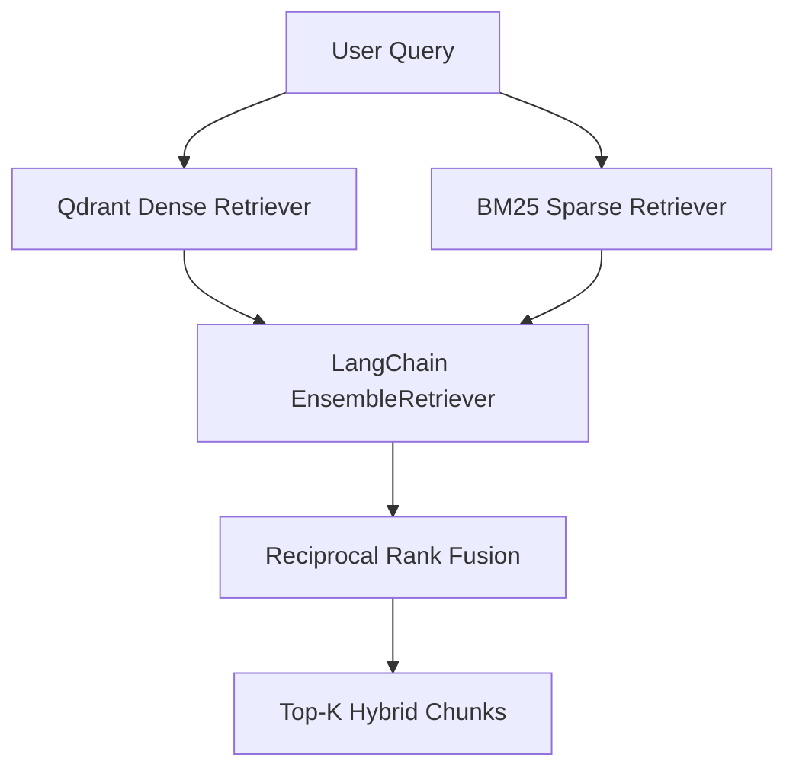

# 📋 Implementation Plan: Hybrid Retrieval (Dense Vector + BM25 Sparse Search)

This document details the step-by-step plan to implement **Hybrid Retrieval** for **Papeer**, combining the existing dense semantic search (Qdrant + Gemini Embeddings) with a sparse keyword search (BM25) to improve query precision for technical terms, formulas, and specific keywords.

---

## 🏗️ Architectural Overview

Currently, retrieval queries only the dense `QdrantVectorStore` using `similarity_search`. We will transition this to a hybrid model:



1. **Dense Retriever**: A vector similarity search powered by Qdrant.
2. **Sparse Retriever**: A local `BM25Retriever` built dynamically from the documents uploaded in the current session.
3. **Ensemble Retriever**: Blends findings from both retrievers using **Reciprocal Rank Fusion (RRF)** with configured weights (e.g., `0.7` dense / `0.3` sparse).

---

## 🛠️ Step-by-Step Action Plan

### Step 1: Dynamic BM25 Document Loading
To run a local BM25 keyword search, the system needs access to the text chunks of the documents uploaded in the current session.
* Add a helper function `get_all_documents(session_id: str) -> list[Document]` in [vector_store.py](file:///C:/Users/abhay/Desktop/papeer/backend/vector_store.py).
* This helper will scroll through all vectors in the session's Qdrant collection to retrieve the complete text payload and metadata, compiling them back into LangChain `Document` objects.

```python
def get_all_documents(session_id: str) -> list[Document]:
    collection_name = get_collection_name(session_id)
    if not qdrant_client.collection_exists(collection_name):
        return []
    docs = []
    offset = None
    while True:
        points, offset = qdrant_client.scroll(
            collection_name=collection_name,
            with_payload=True,
            limit=100,
            offset=offset,
        )
        for point in points:
            payload = point.payload or {}
            # Reconstruct the document
            page_content = payload.get("page_content", "")
            metadata = payload.get("metadata", {})
            docs.append(Document(page_content=page_content, metadata=metadata))
        if offset is None:
            break
    return docs
```

### Step 2: Implement Hybrid Retriever builder
Implement a function `get_hybrid_retriever(session_id: str, k: int = 4)` that constructs the ensemble:
1. Initialize the dense retriever from the `QdrantVectorStore`.
2. Retrieve all documents for the session.
3. If documents exist, initialize `BM25Retriever.from_documents(docs)`.
4. Combine them using LangChain's `EnsembleRetriever`:
   ```python
   from langchain_community.retrievers import BM25Retriever
   from langchain.retrievers import EnsembleRetriever

   # Default weights: 0.7 Dense, 0.3 Sparse
   ensemble_retriever = EnsembleRetriever(
       retrievers=[dense_retriever, sparse_retriever],
       weights=[0.7, 0.3]
   )
   ```
5. Handle edge cases: If no documents have been uploaded yet (empty collection), gracefully return an empty result list or fallback to the dense retriever.

### Step 3: Update Search API in `vector_store.py`
Modify the public `search` function inside [vector_store.py](file:///C:/Users/abhay/Desktop/papeer/backend/vector_store.py) to run the query through the new hybrid retriever.

```python
def search(query: str, session_id: str, k: int = 4) -> list[Document]:
    # 1. Fetch the combined hybrid retriever
    retriever = get_hybrid_retriever(session_id, k=k)
    if not retriever:
        return []
    # 2. Retrieve documents using RRF
    return retriever.invoke(query)
```

---

## 🧪 Validation & Testing

1. **Verify Retrieval Quality**: Use [evaluate.py](file:///C:/Users/abhay/Desktop/papeer/evaluate.py) to run benchmark queries and compare metrics before and after the hybrid retrieval integration.
2. **Keyword Match Test**: Validate that specific alpha-numeric terms (e.g., specific version names, short math variables) which were missed by dense-only search are now successfully retrieved via the BM25 path.
