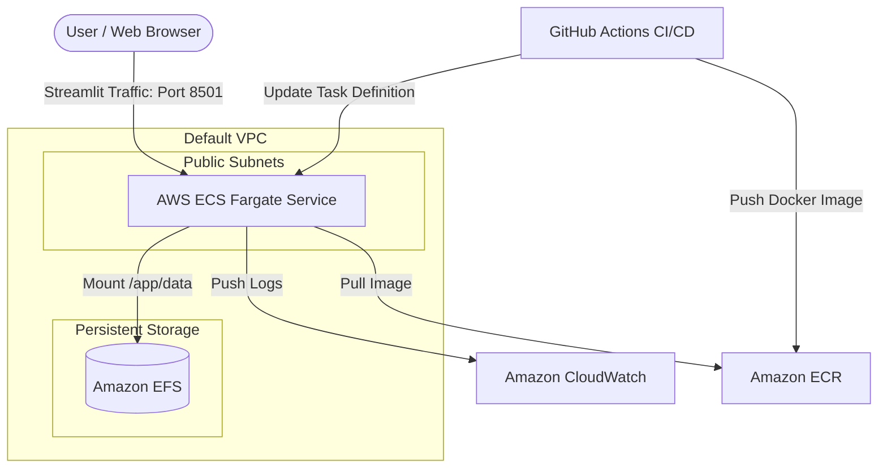

# Deployment Guide: Papeer

This document provides an in-depth guide to the deployment architecture, infrastructure components, containerization, and continuous integration/continuous deployment (CI/CD) pipelines implemented for **Papeer**.

---

## 1. Architecture Overview

Papeer is deployed on **Amazon Web Services (AWS)** using a modern, serverless, and containerized architecture designed for scalability, low maintenance, and data persistence.



### Key Infrastructure Components & Choices

*   **AWS Fargate (Serverless Containers)**: 
    *   *What it is*: A serverless compute engine for containers that works with Amazon Elastic Container Service (ECS).
    *   *Why we use it*: Fargate removes the need to provision, configure, or scale virtual machines (EC2 instances). AWS manages the underlying server management, patching, and provisioning. It is highly cost-effective for applications with variable traffic patterns.
*   **Amazon Elastic Container Registry (ECR)**:
    *   *What it is*: A fully managed Docker container registry.
    *   *Why we use it*: It allows secure storage and sharing of Docker container images within the AWS ecosystem. ECR integrates natively with ECS Fargate, facilitating rapid container image pulls.
*   **Amazon Elastic File System (EFS)**:
    *   *What it is*: A serverless, fully managed, elastic network file system.
    *   *Why we use it*: AWS Fargate tasks are inherently ephemeral—any data written inside the running container is lost when the container restarts or scales. Papeer relies on persistent local databases (SQLite files like `checkpoints.db`) and caches (e.g., embeddings cache). EFS is mounted directly to `/app/data` inside the container, ensuring database transactions and persistent files survive container updates and scale-down events.
*   **Amazon CloudWatch Logs**:
    *   *What it is*: A monitoring and observability service.
    *   *Why we use it*: Fargate tasks don't allow shell access for traditional file-based logging. All container logs (stdout/stderr) are piped directly to a CloudWatch Log Group `/ecs/papeer` to monitor system health, audit user interactions, and debug application errors.

---

## 2. Infrastructure as Code (IaC) with Terraform

All AWS infrastructure for Papeer is defined declaratively using **Terraform** under the [terraform/](file:///C:/Users/abhay/Desktop/papeer/terraform) directory.

### Why Terraform?
1.  **Consistency**: Prevents configuration drift and "human-in-the-loop" errors associated with manual AWS Console configuration.
2.  **State Management**: Tracks real-world infrastructure and cleanly maps dependencies (e.g., ensuring EFS mount targets are fully created before attempting to mount them in ECS Fargate).
3.  **Reproducibility**: Spinning up a staging, testing, or secondary production environment is as simple as executing `terraform apply` with different variable inputs.

### Configuration Breakdown
*   [main.tf](file:///C:/Users/abhay/Desktop/papeer/terraform/main.tf): Defines the core resources:
    *   Default VPC retrieval to avoid paying for custom network address translation (NAT) gateways.
    *   Security groups allowing incoming Streamlit traffic on port `8501` and mounting access on port `2049` (NFS) between the container and EFS.
    *   IAM Roles (`ecs_execution_role` to pull images and write logs, `ecs_task_role` to authorize Fargate mounting of the EFS filesystem).
    *   Fargate Task Definition with pre-configured API keys mapped from secure environment variables.
*   [variables.tf](file:///C:/Users/abhay/Desktop/papeer/terraform/variables.tf): Declares API credentials (Groq, Google, Cohere, Tavily, Qdrant, LangChain) so they are never hardcoded in version control.
*   [outputs.tf](file:///C:/Users/abhay/Desktop/papeer/terraform/outputs.tf): Exposes the ECS Service public IP or DNS endpoint after successful deployment.

---

## 3. Containerization (Docker)

To run the application consistently across developer workstations, staging systems, and AWS Fargate, Papeer is containerized using [Dockerfile](file:///C:/Users/abhay/Desktop/papeer/Dockerfile).

### Container Configuration
*   **Base Image**: Lightweight Python environment.
*   **Data Portability**: The app writes files and caches to `/app/data` (which is mapped to the mounted EFS volume).
*   **Port Exposure**: Exposes Streamlit's default port `8501`.

---

## 4. Continuous Integration & Continuous Deployment (CI/CD)

Automated deployments are driven by GitHub Actions, configured in [.github/workflows/deploy.yml](file:///C:/Users/abhay/Desktop/papeer/.github/workflows/deploy.yml).

### The CI/CD Workflow Pipeline
Whenever code is merged or pushed to the `main` branch, the workflow executes the following steps:

1.  **Checkout Code**: Pulls down the latest codebase from GitHub.
2.  **Configure AWS Credentials**: Uses `aws-actions/configure-aws-credentials` to securely authenticate with AWS using GitHub Repository Secrets (`AWS_ACCESS_KEY_ID`, `AWS_SECRET_ACCESS_KEY`).
3.  **Log in to Amazon ECR**: Obtains authorization tokens to communicate with the private container registry.
4.  **Build, Tag, and Push Docker Image**:
    *   Builds the image from the workspace root.
    *   Tags the image with the unique GitHub commit SHA (`${{ github.sha }}`) to guarantee trace-ability and roll-back options.
    *   Pushes the new tag to ECR.
5.  **Download Active Task Definition**: Queries the AWS ECS API to fetch the current active task definition JSON.
6.  **Update Task Definition**: Replaces the container image tag in the task definition JSON with the newly built Docker image tag.
7.  **Rolling ECS Deploy**: Registers the new task definition and updates the ECS Service. ECS starts a new container with the updated image and safely drains traffic from the older container once the new container passes health checks, achieving **zero-downtime deployment**.

---

## 5. Operations & Execution Guide

### Local Terraform Operations
We provide helper Python scripts to automate local deployments and teardown without manual CLI typing.

#### Deployment
Run [deploy.py](file:///C:/Users/abhay/Desktop/papeer/deploy.py) to deploy or update infrastructure directly from your machine:
```bash
python deploy.py
```
*This loads keys from your local secure `.env` file, binds them to Terraform variables, runs `terraform init`, and executes `terraform apply -auto-approve`.*

#### Teardown
To completely tear down the deployed AWS resources and avoid ongoing AWS charges, run [destroy.py](file:///C:/Users/abhay/Desktop/papeer/destroy.py):
```bash
python destroy.py
```
*This cleans up the ECS Cluster, EFS Filesystem, ECR repository, security groups, and roles.*

---

## 6. Summary of Secrets & Environment Variables

Make sure the following variables are declared either in your local `.env` or as repository secrets in GitHub:

| Variable Name | Description | Required/Optional |
| :--- | :--- | :--- |
| `AWS_ACCESS_KEY_ID` | AWS API Access Key | **Required** |
| `AWS_SECRET_ACCESS_KEY` | AWS API Secret Key | **Required** |
| `AWS_DEFAULT_REGION` | Target deployment region (defaults to `us-east-1`) | Optional |
| `GROQ_API_KEY` | Key for LLM inference | **Required** |
| `GOOGLE_API_KEY` | Key for Google AI/LLM models | Optional |
| `COHERE_API_KEY` | Key for Cohere embedding models | Optional |
| `TAVILY_API_KEY` | Key for web search tool execution | **Required** |
| `QDRANT_URL` | Vector store endpoint URL | **Required** |
| `QDRANT_API_KEY` | Vector store authentication key | **Required** |
| `LANGCHAIN_TRACING_V2` | Toggle LangSmith trace logging (`true`/`false`) | Optional |
| `LANGCHAIN_API_KEY` | LangSmith API Trace Key | Optional |
